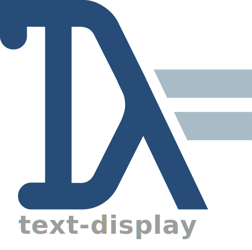

<p align="center">


</p>

<p align="center">
<a href="https://github.com/Kleidukos/text-display/actions"></a>
  
</a>
<a href="https://haskell.org">
  
</a>
</p>

<p align="center">
<a href='https://ko-fi.com/Q5Q327ZHW' target='_blank'></a>
</p>

> *A Typeclass for user-facing output*


## Description

The `text-display` library offers a way for developers to print a textual representation of datatypes that does not
have to abide by the rules of the [Show typeclass][Show].

## Examples

There are two methods to implement `Display` for your type:

The first one is a manual implementation:

```haskell
data ManualType = MT Int

-- >>> display (MT 32)
-- "MT 32"
instance Display ManualType where
  display (MT i) = "MT " <> display i
```

But this can be quite time-consuming, especially if your datatype already has
an existing `Show` that you wish to reuse. In which case, you can piggy-back
on this instance like this:

```haskell
{-# LANGUAGE DerivingVia #-}
data AutomaticallyDerived = AD
  -- We derive 'Show'
  deriving Show 
  -- We take advantage of the 'Show' instance to derive 'Display' from it
  deriving Display
    via (ShowInstance AutomaticallyDerived) 
```

But let's say you want to redact an instance of `Display`? You can do it locally, through
the `OpaqueInstance` helper. It is most useful to hide tokens or passwords:

```haskell
data UserToken = UserToken UUID                           
 deriving Display                                         
   via (OpaqueInstance "[REDACTED]" UserToken)            
                                                          
display $ UserToken "7a01d2ce-31ff-11ec-8c10-5405db82c3cd"
-- => "[REDACTED]"                                              
```

## Design Choices

### A “Lawless Typeclass”[^1]

The `Display` typeclass does not contain any law. This is a controversial choice for some people,
but the truth is that there are not any laws to ask of the consumer that are not already enforced
by the type system and the internals of the `Text` type.

### "🚫 You should not derive Display for function types!"

Sometimes, when using the library, you may encounter this message:

```
• 🚫 You should not derive Display for function types!                     
  💡 Write a 'newtype' wrapper that represents your domain more accurately.
     If you are not consciously trying to use `display` on a function,     
     make sure that you are not missing an argument somewhere.
```

The `display` library does not allow the definition and usage of `Display` on
bare function types (`(a -> b)`).  
Experience and time have shown that due to partial application being baked in the language,
many users encounter a partial application-related error message when a simple missing
argument to a function is the root cause.

There may be legitimate uses of a `Display` instance on a function type.
But these usages are extremely dependent on their domain of application.
That is why it is best to wrap them in a newtype that can better
express and enforce the domain.


### "🚫 You should not derive Display for ByteStrings!"

An arbitrary ByteStrings cannot be safely converted to text without prior knowledge of its encoding.
As such, in order to avoid dangerously blind conversions, it is recommended to use a specialised
function such as `decodeUtf8'` or `decodeUtf8Strict` if you wish to turn a UTF8-encoded ByteString
to Text.

[^1]: _"mort aux lois, vive l'anarchie"_ - Georges Brassens

[Show]: https://hackage.haskell.org/package/base/docs/Text-Show.html#v:Show
